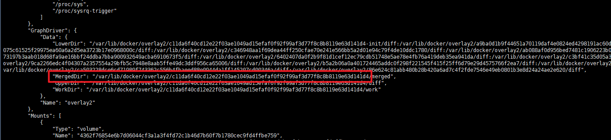

## Docker 查看宿主机配置文件目录
1.使用命令 docker inspect [Mysql ID]查看镜像的配置信息
2.获取 GraphDriver.Data.MergedDir属性

3.进入到文件夹  /var/lib/docker/overlay2/c11da6f40cd12e22f03ae1049ad15efaf0f92f99af3d77f8c8b8119e63d141d4/
4.再进入到 diff/etc  就可以修改容器内配置信息
