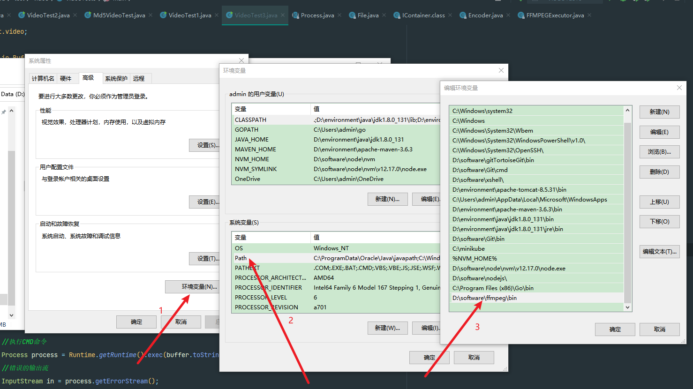
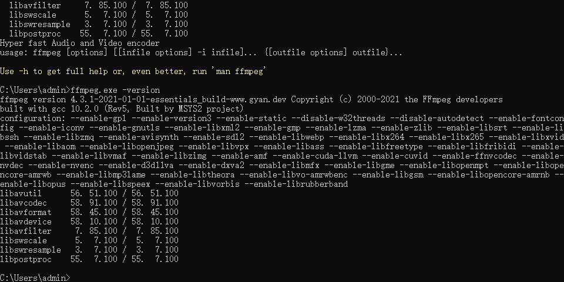
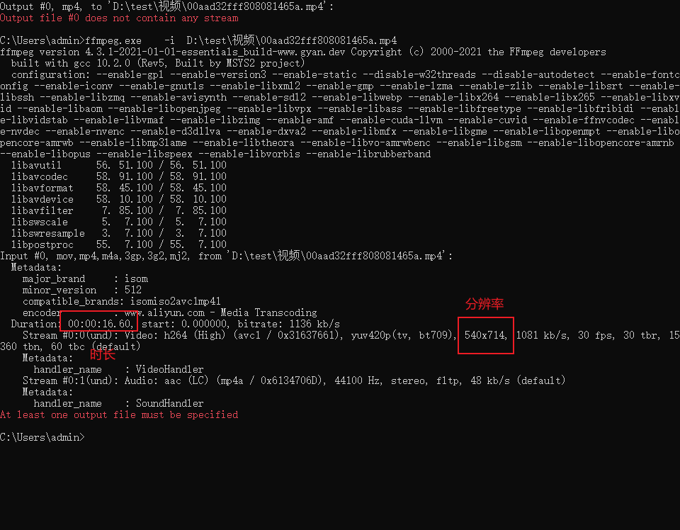
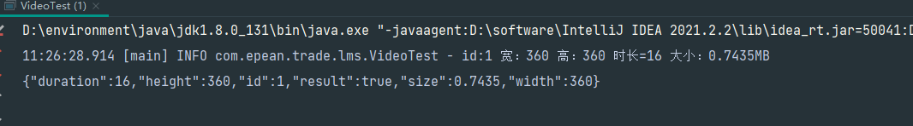

### 解析视频分辨率和时长
####下载工具
使用的工具是：FFmpeg 分为win 和 linux
需要提前安装 FFmpeg

[windows版本](https://itdfq.lanzouy.com/iVONE0gtzerc) 

[linux版本](https://itdfq.lanzouy.com/imCTY0gtzegb)

[有道笔记](https://note.youdao.com/s/6CaSKFrm)

#### windows 安装

将下载的进行解压，配置系统环境变量



#### CMD命令行解析视频信息

配置结束后，可以使用

```ffmpeg.exe -version``` 查看是否安装成功



解析视频信息：```ffmpeg.exe  -i   D:\test\视频\00aad32fff808081465a.mp4```



#### Linux安装

具体安装步骤可以参考：https://cloud.tencent.com/developer/article/1711770
#### 代码解析
```java
/**
 *    ffmepg工具地址
 */
private  static final String FFMPEG_PATH =  "D:\\software\\ffmpeg\\bin\\ffmpeg.exe";

public static VideoInfoResponse getVideoInfo2(String url, Integer id) throws BaseAppException {
    File file = getUrl(url);
    //Integer index = url.lastIndexOf("/");
    //String name = url.substring(index + 1);
    //String videoPath = "D:\\test\\视频\\" + name;
    //File file = new File(videoPath);
    long length = file.length();
    BigDecimal bigDecimal = BigDecimal.valueOf(length);
    //文件大小
    BigDecimal size = bigDecimal.divide(new BigDecimal(1048576), 4, RoundingMode.HALF_UP);
    //拼接cmd命令语句
    StringBuffer buffer = new StringBuffer();
    buffer.append(FFMPEG_PATH);
    //注意要保留单词之间有空格
    buffer.append(" -i ");
    buffer.append(file.getAbsolutePath());
    VideoInfoResponse response = new VideoInfoResponse();
    response.setId(id);
    response.setSize(size);
    //执行命令语句并返回执行结果
    try {
        //执行CMD命令
        Process process = Runtime.getRuntime().exec(buffer.toString());
        //错误的输出流
        InputStream in = process.getErrorStream();
        BufferedReader br = new BufferedReader(new InputStreamReader(in));
        String line;
        while ((line = br.readLine()) != null) {
            if (line.trim().startsWith("Duration:")) {
                //根据字符匹配进行切割
                String substring = line.trim().substring(0, line.trim().indexOf(","));
                //00:00:11.60
                String substring1 = substring.substring(substring.lastIndexOf(' ') + 1);


                String[] my = substring1.split(":");

                int hour = Integer.parseInt(my[0]);

                int min = Integer.parseInt(my[1]);

                double sec = Double.valueOf(my[2]);

                double zong = hour * 3600 + min * 60 + sec;
               response.setDuration((long) zong);
            }
            //一般包含fps的行就包含分辨率
            if (line.contains("fps")) {
                //解析 Stream #0:0(und): Video: h264 (High) (avc1 / 0x31637661), yuv420p(tv, bt709), 540x714, 1081 kb/s, 30 fps, 30 tbr, 15360 tbn, 60 tbc (default)
                int x = line.lastIndexOf('x');
                // 360x360
                String substring = line.substring(x - 4, x + 4);
                //去除所有的空格和逗号
                String s = substring.replaceAll(",", "");
                String s1 = s.replaceAll(" ", "");
                int x1 = s1.indexOf('x');
                Integer width = Integer.parseInt(s1.substring(0,x1));
                Integer height = Integer.parseInt(s1.substring(x1+1));
                response.setHeight(height);
                response.setWidth(width);
                log.info("id:"+id+" 宽："+width+" 高："+height+" 时长="+response.getDuration()+" 大小："+size+"MB");
            }
        }
        response.setResult(true);
        return response;
    } catch (Exception e) {
       log.error("id:{}解析失败",id,e.getMessage(),e);
        VideoInfoResponse response1 = new VideoInfoResponse();
        response1.setId(id);
        response1.setResult(false);
        return response1;
    }
}

public static File getUrl(String url) throws BaseAppException {
    try {
        Integer index = url.lastIndexOf("/");
        String name = url.substring(index + 1);
        URL urls = new URL(url);
        URLConnection connection = urls.openConnection();
        connection.setDoOutput(true);
        InputStream inputStream = connection.getInputStream();
        //时间戳+6位随机数
        //SimpleDateFormat sdf2 = new SimpleDateFormat("yyyyMMddhhmmssSSS");
        //String date2 = sdf2.format(new Date());
        //String random = String.valueOf((int) ((Math.random() * 9 + 1) * Math.pow(10,5)));
        String preName = "D:\\test\\视频2\\" + name;
        File file = new File(preName);
        try {
            FileOutputStream outputStream = FileUtils.openOutputStream(file);
            try {
                IOUtils.copy(inputStream, outputStream);
                outputStream.close();
            } finally {
                IOUtils.closeQuietly(outputStream);
            }
        } finally {
            IOUtils.closeQuietly(inputStream);
        }
        //// commons-io
        //FileUtils.copyInputStreamToFile(inputStream, file);
        return file;
    } catch (Exception e) {
        log.error("读取url文件异常,msg:{}", e.getMessage(), e);
        throw new BaseAppException(e.getMessage());
    }
}

@Data
public static class VideoInfoResponse implements Serializable {
    Integer id;
    /**
     * 视频大小(单位MB 保留4为小数)
     */
    private BigDecimal size;
    private Integer height;
    private Integer width;
    /**
     * 时长
     */
    private Long duration;

    /**
     * true：通过校验
     */
    private Boolean result;

    /**
     * 备注
     */
    private String remark;


}
```

执行结果：

